# Allen's Awesome Vision-Language-Action (VLA) Models

Repository to run experiments with various VLA (Vision-Language-Action) models on SoArm-101.

## Project Goal

This project aims to explore and benchmark different VLA models for robotic manipulation tasks using the SoArm-101 robot arm. The workflow consists of two main phases:

1. **Teleoperation & Data Collection Pipeline**: Setup LeRobot with SoArm for teleoperating the robot and collecting high-quality demonstration datasets
2. **Training & Deployment Pipeline**: Implement, train, and deploy various VLA models (π0, π0.5, ACT, etc.) and evaluate their performance

## Architecture Overview

```mermaid
flowchart TB
    subgraph TELEOP["🎮 Teleoperation"]
        LA[/"👋 Leader Arm<br/>(Human Control)"/]
        FA1["🦾 Follower Arm<br/>(Mirrors Leader)"]
        LA -->|"Position Commands<br/>@ 20-30 Hz"| FA1
    end

    subgraph DATACOLLECT["📹 Data Collection"]
        subgraph THREADS["⚡ Multi-threaded Architecture"]
            direction LR
            IMG_THREAD["🔄 Image Capture<br/>Thread"]
            CMD_THREAD["🔄 Command Server<br/>Thread"]
            MAIN_THREAD["🔄 Main Loop<br/>(Teleop + Record)"]
        end

        TELNET["📡 Telnet Server<br/>:1234<br/>(s=start/stop, a=abort, q=quit)"]
        CAM["📷 Camera<br/>(RGB Frames)"]
        FA2["🦾 Follower Arm<br/>(Joint States)"]
        LA2[/"👋 Leader Arm<br/>(Action Labels)"/]

        TELNET --> CMD_THREAD
        CAM --> IMG_THREAD
        IMG_THREAD --> OBS
        FA2 --> OBS
        LA2 --> ACT_LABEL

        OBS["Observations<br/>• observation.images.front<br/>• observation.state"]
        ACT_LABEL["Actions<br/>• action (6 joints)"]

        OBS --> EP
        ACT_LABEL --> EP
        EP["Episode Buffer<br/>(Controlled via telnet)"]
    end

    subgraph DATASET["💾 LeRobot Dataset"]
        direction TB
        LOCAL_DS[("🗂️ Local Dataset<br/>data/{repo-id}/")]
        HF_DS[("🤗 Hugging Face Hub<br/>username/dataset-name")]

        LOCAL_DS <-->|"push/pull<br/>huggingface_hub"| HF_DS
    end

    subgraph TRAINING["🏋️ Training Pipeline"]
        direction TB
        DS_LOAD["Dataset Loader<br/>(LeRobotDataset)"]
        ACT_MODEL["🧠 ACT Model<br/>(Action Chunking<br/>Transformer)"]
        CKPT[("💾 Checkpoints<br/>outputs/pretrained_model/")]
        WANDB["📊 Weights & Biases<br/>(Optional Logging)"]

        DS_LOAD --> ACT_MODEL
        ACT_MODEL -->|"Save @ N steps"| CKPT
        ACT_MODEL -.->|"Metrics"| WANDB
    end

    subgraph INFERENCE_LOCAL["🤖 Local Inference"]
        direction TB
        POLICY_L["🧠 ACT Policy"]
        ROBOT_L["🦾 SO101 Robot"]
        CAM_L["📷 Camera"]

        CAM_L -->|"RGB Frame"| POLICY_L
        ROBOT_L -->|"Joint State"| POLICY_L
        POLICY_L -->|"Action Chunk<br/>(100 steps)"| ROBOT_L
    end

    subgraph INFERENCE_REMOTE["🌐 Client-Server Inference"]
        direction TB
        subgraph SERVER["☁️ GPU Server"]
            POLICY_S["🧠 ACT Policy<br/>(CUDA)"]
            TCP_S["TCP Server<br/>:8000"]
        end

        subgraph CLIENT["🤖 Robot Client (Jetson)"]
            ROBOT_C["🦾 SO101 Robot"]
            CAM_C["📷 Camera"]
            TCP_C["TCP Client"]
        end

        CAM_C -->|"RGB"| TCP_C
        ROBOT_C -->|"State"| TCP_C
        TCP_C <-->|"Observations ➡️<br/>⬅️ Actions<br/>(pickle/TCP)"| TCP_S
        TCP_S <--> POLICY_S
        TCP_C -->|"Actions"| ROBOT_C
    end

    subgraph EVAL["📊 Evaluation"]
        EVAL_DS[("🗂️ Eval Dataset<br/>repo-id/eval_results")]
        HF_EVAL[("🤗 Hugging Face Hub")]

        EVAL_DS -->|"--push-to-hub"| HF_EVAL
    end

    %% Main Flow Connections
    TELEOP ==>|"Human demos"| DATACOLLECT
    EP ==>|"Episodes"| LOCAL_DS
    HF_DS ==>|"Download"| DS_LOAD
    CKPT ==>|"Load model"| POLICY_L
    CKPT ==>|"Load model"| POLICY_S
    INFERENCE_LOCAL -.->|"Save results"| EVAL_DS
    INFERENCE_REMOTE -.->|"Save results"| EVAL_DS

    %% Styling
    classDef huggingface fill:#FFD21E,stroke:#FF9D00,color:#000
    classDef storage fill:#E8F4FD,stroke:#1E88E5,color:#000
    classDef model fill:#E8F5E9,stroke:#43A047,color:#000
    classDef hardware fill:#FFF3E0,stroke:#FB8C00,color:#000
    classDef network fill:#E1BEE7,stroke:#8E24AA,color:#000
    classDef thread fill:#B2EBF2,stroke:#00ACC1,color:#000

    class HF_DS,HF_EVAL huggingface
    class LOCAL_DS,CKPT,EVAL_DS storage
    class ACT_MODEL,POLICY_L,POLICY_S model
    class LA,FA1,FA2,LA2,ROBOT_L,ROBOT_C,CAM,CAM_L,CAM_C hardware
    class TELNET,TCP_S,TCP_C network
    class IMG_THREAD,CMD_THREAD,MAIN_THREAD thread
```



### Data Flow Summary

| Stage | Input | Output | Storage |
|-------|-------|--------|---------|
| **Teleoperation** | Human hand movements | Leader arm positions | - |
| **Data Collection** | Camera frames + Joint states | LeRobot Episodes | `data/{repo-id}/` |
| **Dataset Sync** | Local dataset | Cloud dataset | 🤗 Hugging Face Hub |
| **Training** | Dataset episodes | Model checkpoints | `outputs/pretrained_model/` |
| **Inference** | Live observations | Action commands | Eval dataset (optional) |

## Installation

### Prerequisites

- Python 3.12 or higher
- [uv](https://github.com/astral-sh/uv) - Fast Python package installer and resolver

### 1. Install uv

If you don't have uv installed, install it using:

```bash
curl -LsSf https://astral.sh/uv/install.sh | sh
```

Or on macOS/Linux using brew:

```bash
brew install uv
```

### 2. Clone the Repository

```bash
git clone https://github.com/jliu6718/allen-vla.git
cd allen-vla
```

### 3. Install Dependencies

```bash
uv sync
```

This will create a virtual environment and install all dependencies specified in `pyproject.toml`:
- huggingface-hub (>=0.35.3)
- lerobot[feetech] (>=0.4.2)
- opencv-python (>=4.12.0.88)
- pynput (>=1.8.1)
- uuid (>=1.30)

### 4. Activate the Virtual Environment

```bash
source .venv/bin/activate
```

Or if you're using uv to run commands directly:

```bash
uv run python <script>.py
```

## Project Structure

```
allen-vla/
├── assets/
│   └── data_collection_demo.gif
├── calibration/
│   ├── __init__.py
│   └── calibrate.py              # Calibration script for SO101 follower arm
├── data_collection/
│   ├── __init__.py
│   └── collect.py                # Main data collection script
├── example/
│   ├── data_collection.bash      # Unified data collection script (ACT/Diffusion)
│   ├── act/                      # ACT policy example scripts
│   │   ├── inference_act.bash
│   │   ├── inference_act_client.bash
│   │   ├── inference_act_server.bash
│   │   └── train_act.bash
│   ├── diffusion/                # Diffusion policy example scripts
│   │   ├── inference_diffusion.bash
│   │   ├── inference_diffusion_client.bash
│   │   ├── inference_diffusion_server.bash
│   │   └── train_diffusion.bash
│   └── teleop.bash               # Example: teleoperation
├── policy/
│   ├── __init__.py
│   ├── act/
│   │   ├── __init__.py
│   │   ├── train.py              # Training script for ACT policy
│   │   ├── inference.py          # Local inference (policy + robot on same machine)
│   │   ├── inference_server.py   # TCP server for remote inference (GPU machine)
│   │   └── inference_client.py   # Robot client (connects to inference server)
│   └── diffusion/
│       ├── __init__.py
│       ├── train.py              # Training script for Diffusion policy
│       ├── inference.py          # Local inference
│       ├── inference_server.py   # TCP server for remote inference
│       └── inference_client.py   # Robot client
├── scripts/
│   ├── deploy_remote.bash        # Deploy project files to remote machine
│   ├── download_data.bash        # Download collected data from remote machine
│   └── download_model.bash       # Download trained models from remote machine
├── teleop/
│   ├── __init__.py
│   └── teleop.py                 # Teleoperation script for leader-follower control
├── udev/
│   ├── 99-so101.rules            # Udev rules for consistent device naming
│   └── README.md
├── __init__.py
├── main.py
├── robot_utils.py                # Shared utilities for robot initialization
├── utils.py                      # Common utilities including colored logging
├── pyproject.toml
└── README.md
```

All scripts use a common logging infrastructure with color-coded output for better visibility during operations.

## Hardware Setup

### Configure Udev Rules for SO101 Robot Arms

To access the robot arms without sudo and with consistent device names:

#### 1. Install Udev Rules

```bash
sudo cp udev/99-so101.rules /etc/udev/rules.d/
```

#### 2. Add Your User to the dialout Group

```bash
sudo usermod -a -G dialout $USER
```

**Important**: Log out and log back in for the group change to take effect.

#### 3. Reload Udev Rules

```bash
sudo udevadm control --reload-rules
sudo udevadm trigger
```

#### 4. Test Hardware Connection

Disconnect and reconnect your SO101 arms. You should now be able to access them without `sudo`.

For detailed hardware setup instructions including creating symbolic links for consistent device naming, see [udev/README.md](udev/README.md).

## Deployment

### Deploy to Remote Device

To deploy this project to a remote device (e.g., Jetson):

```bash
./scripts/deploy_remote.bash <username> <hostname>
```

**Example:**

```bash
./scripts/deploy_remote.bash allen jetson
```

This script uses rsync to sync all project files (excluding virtual environments, cache files, data, and models) to the remote machine at `/home/<username>/.ws/vla_ws/`.

### Download Data from Remote

To download collected datasets from a remote machine:

```bash
./scripts/download_data.bash <username> <hostname>
```

**Example:**

```bash
./scripts/download_data.bash allen jetson
```

This syncs the `data/` directory from the remote machine to your local project.

### Download Models from Remote

To download trained models from a remote machine:

```bash
./scripts/download_model.bash <username> <hostname>
```

**Example:**

```bash
./scripts/download_model.bash allen jetson
```

This syncs the `model/` directory from the remote machine to your local project.

## Usage

### Calibration

Before using the robot, you may need to calibrate the follower arm to set the zero positions for each joint:

```bash
python calibration/calibrate.py --port /dev/ttyACM0 --id my_follower
```

Or using uv:

```bash
uv run python calibration/calibrate.py --port /dev/ttyACM0 --id my_follower
```

The script accepts the following command-line arguments:

- `--port`: Serial port for the follower arm (required)
- `--id`: Robot ID for the follower arm (required)

The calibration process will:
1. Connect to the follower arm
2. Run the calibration routine to set joint zero positions
3. Disconnect when complete

### Teleoperation

Run the teleoperation script to control the follower arm using the leader arm:

```bash
python teleop/teleop.py
```

Or using uv:

```bash
uv run python teleop/teleop.py
```

> **Example**: See [`example/teleop.bash`](example/teleop.bash) for a complete example.

The script accepts the following command-line arguments:

- `--leader-port`: Serial port for the leader arm (default: `/dev/ttyACM0`)
- `--leader-id`: ID for the leader arm (default: `my_leader`)
- `--follower-port`: Serial port for the follower arm (default: `/dev/ttyACM1`)
- `--follower-id`: ID for the follower arm (default: `my_follower`)
- `--frequency`: Control frequency in Hz (default: `20.0`)

**Example with custom ports:**

```bash
python teleop/teleop.py --leader-port /dev/ttyACM2 --follower-port /dev/ttyACM3
```

**Example with custom IDs:**

```bash
python teleop/teleop.py --leader-id leader_arm --follower-id follower_arm
```

The teleoperation interface will:
1. Connect to both leader and follower arms
2. Disable torque on the leader arm (so you can move it by hand)
3. Mirror the leader arm's movements on the follower arm in real-time
4. Print observation data to the console
5. Run until interrupted with `Ctrl+C`

### Data Collection


Collect demonstration datasets for training VLA models using the unified data collection script:

```bash
# For ACT policy
./example/data_collection.bash act

# For Diffusion policy
./example/data_collection.bash diffusion

# With custom task
./example/data_collection.bash act --task pick_cube
```

**Script Features:**

All example scripts support:
- `-h, --help` - Show detailed usage information
- `--dry-run` - Preview configuration without executing
- `--task TASK` - Specify task name (optional)
- Environment variable overrides for all parameters

**Common Environment Variables:**

| Variable | Description | Default |
|----------|-------------|---------|
| `LEADER_PORT` | Leader arm serial port | `/dev/ttyACM1` |
| `FOLLOWER_PORT` | Follower arm serial port | `/dev/ttyACM0` |
| `USERNAME` | HuggingFace username | `jliu6718` |
| `TASK` | Task name | `place_brick` |
| `CAMERA_INDEX` | Camera device index | `0` |
| `PUSH_TO_HUB` | Push to HuggingFace Hub | `true` |

**Example with custom configuration:**

```bash
# Override task via argument
./example/data_collection.bash act --task pick_cube

# Override task and username via environment
TASK=pick_cube USERNAME=myuser ./example/data_collection.bash diffusion

# Preview configuration without running
./example/data_collection.bash act --dry-run

# Show all available options
./example/data_collection.bash --help
```

The repo-id is automatically constructed as `{username}/{policy_type}-{robot_type}-{task}`.

The data collection interface will:
1. Connect to both leader and follower arms
2. Create a LeRobot dataset with the specified task name
3. Start a telnet server for remote control (connect via `telnet localhost 1234`)
4. Run a separate image capture thread for continuous camera streaming
5. Commands via telnet:
   - `s` - Start/stop recording episodes
   - `a` - Abort current episode (discard frames)
   - `q` - Quit and save dataset
6. Capture observations and actions at the specified Hz (default: 30) during recording
7. Save episodes to the dataset with video encoding
8. Press `Ctrl+C` to finalize and optionally upload the dataset to Hugging Face Hub

### ACT Policy


The ACT (Action Chunking Transformer) policy is fully implemented with training, local inference, and client-server inference for remote GPU setups.

**Quick Start with Example Scripts:**

```bash
# Training
./example/act/train_act.bash

# Local inference
./example/act/inference_act.bash

# Client-server inference (remote GPU)
./example/act/inference_act_server.bash  # On GPU server
./example/act/inference_act_client.bash  # On robot machine
```

**Training Configuration:**

| Variable | Description | Default |
|----------|-------------|---------|
| `REPO_ID` | Dataset repo ID on HuggingFace | `jliu6718/act-so101-place_brick` |
| `OUTPUT_DIR` | Model output directory | `$PROJECT_ROOT/model` |
| `BATCH_SIZE` | Training batch size | `32` |
| `STEPS` | Number of training steps | `10000` |
| `PUSH_TO_HUB` | Push model to HuggingFace | `true` |
| `RESUME` | Checkpoint path to resume from | (none) |

**Training Examples:**

```bash
# Custom training configuration
REPO_ID=myuser/act-so101-pick_cube STEPS=20000 ./example/act/train_act.bash

# Using --task to override task name (updates REPO_ID automatically)
./example/act/train_act.bash --task pick_cube

# Resume training from checkpoint
RESUME=/path/to/checkpoint.pt ./example/act/train_act.bash

# Preview configuration
./example/act/train_act.bash --dry-run
```

**Inference Configuration:**

| Variable | Description | Default |
|----------|-------------|---------|
| `CHECKPOINT` | Model checkpoint | `jliu6718/act-so101-place_brick` |
| `ROBOT_PORT` | Robot serial port | `/dev/ttyACM0` |
| `CAMERA_INDEX` | Camera device index | `0` |
| `FPS` | Inference frequency | `30` |
| `DISPLAY_VIDEO` | Show video feed | `false` |

**Client-Server Inference:**

For running inference on a remote GPU while the robot is on a different machine:

```bash
# On GPU server
CHECKPOINT=myuser/act-so101-task PORT=8000 ./example/act/inference_act_server.bash

# On GPU server using --task to override
./example/act/inference_act_server.bash --task pick_cube

# On robot machine
SERVER_HOST=192.168.1.100 ./example/act/inference_act_client.bash

# Test connection before starting
./example/act/inference_act_client.bash --test-connection
```

**Naming Convention:**

| Script | Repo-ID Format |
|--------|----------------|
| Data Collection | `{username}/{policy}-{robot}-{task}` |
| Training (push) | `{username}/{policy}-{robot}-{task}` |
| Inference (eval) | `{username}/eval_{policy}-{robot}-{task}` |

For detailed documentation including all arguments and examples, see **[docs/act.md](docs/act.md)**.

### Diffusion Policy

The Diffusion policy provides an alternative approach using diffusion models for action prediction.

**Quick Start with Example Scripts:**

```bash
# Training
./example/diffusion/train_diffusion.bash

# Local inference
./example/diffusion/inference_diffusion.bash

# Client-server inference (remote GPU)
./example/diffusion/inference_diffusion_server.bash  # On GPU server
./example/diffusion/inference_diffusion_client.bash  # On robot machine
```

**Training Configuration:**

| Variable | Description | Default |
|----------|-------------|---------|
| `REPO_ID` | Dataset repo ID on HuggingFace | `jliu6718/diffusion-so101-place_brick` |
| `LOCAL_DIR` | Local dataset directory (overrides REPO_ID) | (none) |
| `OUTPUT_DIR` | Model output directory | `$PROJECT_ROOT/model` |
| `BATCH_SIZE` | Training batch size | `8` |
| `STEPS` | Number of training steps | `100000` |
| `HORIZON` | Prediction horizon | `16` |
| `N_ACTION_STEPS` | Number of action steps | `8` |
| `N_OBS_STEPS` | Number of observation steps | `2` |
| `LR` | Learning rate | `1e-4` |
| `SAVE_FREQ` | Checkpoint save frequency | `5000` |

**Training Examples:**

```bash
# Custom training configuration
REPO_ID=myuser/diffusion-so101-pick_cube STEPS=50000 ./example/diffusion/train_diffusion.bash

# Using --task to override task name (updates REPO_ID automatically)
./example/diffusion/train_diffusion.bash --task pick_cube

# Train from local dataset
LOCAL_DIR=./data/my_dataset ./example/diffusion/train_diffusion.bash

# Custom diffusion hyperparameters
HORIZON=32 N_ACTION_STEPS=16 ./example/diffusion/train_diffusion.bash
```

**Inference Configuration:**

| Variable | Description | Default |
|----------|-------------|---------|
| `CHECKPOINT` | Model checkpoint | `jliu6718/diffusion-so101-place_brick` |
| `ROBOT_PORT` | Robot serial port | `/dev/ttyACM0` |
| `CAMERA_INDEX` | Camera device index | `0` |
| `NUM_EPISODES` | Number of episodes to run | `10` |
| `EPISODE_TIME` | Episode duration (seconds) | `60` |
| `RESET_TIME` | Reset time between episodes | `60` |

**Client-Server Inference:**

```bash
# On GPU server
CHECKPOINT=myuser/diffusion-so101-task PORT=8000 ./example/diffusion/inference_diffusion_server.bash

# On GPU server using --task to override
./example/diffusion/inference_diffusion_server.bash --task pick_cube

# On robot machine
SERVER_HOST=192.168.1.100 ./example/diffusion/inference_diffusion_client.bash

# Test connection before starting
./example/diffusion/inference_diffusion_client.bash --test-connection
```

### Script Features Summary

All example scripts in `example/`, `example/act/`, and `example/diffusion/` include:

| Feature | Description |
|---------|-------------|
| `-h, --help` | Show detailed usage and all environment variables |
| `--dry-run` | Preview configuration and dependency checks without running |
| `--task TASK` | Override task name (updates REPO_ID/CHECKPOINT automatically) |
| Color output | Color-coded status messages (green=success, yellow=warning, red=error) |
| Dependency checks | Validates uv, GPU, serial ports, cameras before execution |
| Environment variables | All parameters configurable via environment variables |

**Common Checks Performed:**

- `uv` package manager availability
- Serial port existence (with fallback listing)
- Camera device availability
- GPU/CUDA availability (for training/server scripts)
- Port availability (for server scripts)
- Disk space (for training scripts)
- HuggingFace authentication (when pushing to Hub)

## Todo List

### Phase 1: Teleoperation & Data Collection ✓
- [x] Setup LeRobot environment and dependencies
- [x] Configure SoArm-101 hardware integration with LeRobot
- [x] Implement teleoperation interface
- [x] Setup camera(s) and sensor pipeline
- [x] Develop data collection scripts
- [x] Define data format and storage structure (using LeRobot dataset format)
- [x] Test teleoperation and record sample demonstrations
- [x] Create dataset management utilities (keyboard-controlled recording, HF Hub integration)

### Phase 2: Training & Deployment Pipeline ✓
- [x] Setup training infrastructure (GPU environment, configs)
- [x] Implement ACT (Action Chunking Transformer) training pipeline
- [x] Implement ACT local inference/evaluation pipeline
- [x] Implement ACT client-server inference (remote GPU support)
- [x] Test deployed ACT model on real hardware
- [x] Implement Diffusion policy training pipeline
- [x] Implement Diffusion policy local inference/evaluation pipeline
- [x] Implement Diffusion policy client-server inference
- [ ] Implement π0 model training pipeline
- [ ] Implement π0.5 model training pipeline
- [ ] Add additional VLA models as needed
- [ ] Create evaluation metrics and benchmarking scripts
- [ ] Compare model performance and document results

### Documentation & Experimentation
- [x] Document hardware setup and calibration procedures
- [x] Create training guides for ACT model
- [x] Create training guides for Diffusion model
- [ ] Create training guides for π0/π0.5 models
- [ ] Log experimental results and hyperparameters
- [ ] Build visualization tools for trajectories and predictions

## License

This project is licensed under the MIT License - see below for details:

```
MIT License

Copyright (c) 2025 Allen Liu

Permission is hereby granted, free of charge, to any person obtaining a copy
of this software and associated documentation files (the "Software"), to deal
in the Software without restriction, including without limitation the rights
to use, copy, modify, merge, publish, distribute, sublicense, and/or sell
copies of the Software, and to permit persons to whom the Software is
furnished to do so, subject to the following conditions:

The above copyright notice and this permission notice shall be included in all
copies or substantial portions of the Software.

THE SOFTWARE IS PROVIDED "AS IS", WITHOUT WARRANTY OF ANY KIND, EXPRESS OR
IMPLIED, INCLUDING BUT NOT LIMITED TO THE WARRANTIES OF MERCHANTABILITY,
FITNESS FOR A PARTICULAR PURPOSE AND NONINFRINGEMENT. IN NO EVENT SHALL THE
AUTHORS OR COPYRIGHT HOLDERS BE LIABLE FOR ANY CLAIM, DAMAGES OR OTHER
LIABILITY, WHETHER IN AN ACTION OF CONTRACT, TORT OR OTHERWISE, ARISING FROM,
OUT OF OR IN CONNECTION WITH THE SOFTWARE OR THE USE OR OTHER DEALINGS IN THE
SOFTWARE.
```

## Citation

If you use this codebase in your research, please cite:

```bibtex
@software{liu2025allen_vla,
  author = {Liu, Allen},
  title = {Allen's Awesome Vision-Language-Action (VLA) Models},
  year = {2025},
  url = {https://github.com/jliu6718/allen-vla},
  note = {Repository for VLA model experiments on SoArm-101}
}
```

This project builds upon [LeRobot](https://github.com/huggingface/lerobot) by Hugging Face:

```bibtex
@misc{cadene2024lerobot,
  author = {Cadene, Remi and Alibert, Simon and Soare, Alexander and Gallouedec, Quentin and Zouitine, Adil and Wolf, Thomas},
  title = {LeRobot: State-of-the-art Machine Learning for Real-World Robotics in Pytorch},
  year = {2024},
  publisher = {GitHub},
  journal = {GitHub repository},
  howpublished = {\url{https://github.com/huggingface/lerobot}}
}
```
